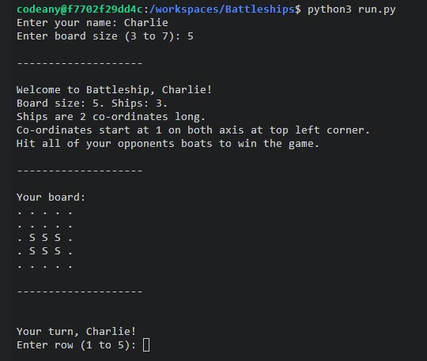

# Battleship!

- This Python-based implementation of the classic Battleship game allows a single player to play against the computer, it is played within the Python terminal. 

- The game is played on a square grid where each player has a fleet of ships. The objective is to sink all of your opponent's ships before they sink all of yours.

Visit the deployed website [here](https://battleship-python98-c71c6949cf34.herokuapp.com/).

# 1. How to play

### Game Setup

- Battleship is based on the classic board/paper and pen game, further information on the game can be found on its [Wikipedia](https://en.wikipedia.org/wiki/Battleship_(game) "Link to CSS Wikipedia page")

- At the start of the game, players enter their name for a personalized experience.

- The game board is a grid of 3x3 up to 7x7, board size is chosen by the user at the start of the game.

- Each player, the user and the computer, secretly places ships (the number of ships ranges depending on the size of the board chosen) on their board. Each ship occupies 2 consecutive cells on the grid.

- The ships can be placed either horizontally or vertically, and their placement is random and hidden from the opponent.

- Ships are placed on the board and indicated by an S. Guesses are marked on the board using -, hits are indicated by an X.

### Gameplay

- The user enters their name before the game begins.

- The user selects which size board they wish to choose. 

- Players take turns to "fire" at the opponent's grid by guessing the coordinates.

- The game asks for row and column numbers separately. Both coordinates start from 1, with 1,1 being the top left corner of the grid. After each guess, the game informs the player whether it was a hit or a miss.

- If a ship is hit at all its coordinates, it is considered sunk.

- The game board does not reveal ship locations, but it does show the results of each player's shots. The player's and computer's scores (number of successful hits) are displayed after each round.

### Winning the Game

- The game continues until all ships of one player are sunk.

- If all of the computer's ships are sunk first, the player wins. Conversely, if all of the player's ships are sunk first, the computer wins.

- The game announces the winner.

# 2. Features

### Existing Feature

#### User entry
  - Accepts user input for both coordinates.
  - Before the game begins players are prompted to enter their name, the game cannot start till a name or username is provided.
  - Once a name is provided, the game will address the user as the name provided.
  - User able to select board size ranging from 3x3 to 7x7.
  - The number of ships will vary depending on the size of board (max ships = board size -2)

#### Random generation 
  - Ships locations are randomly generated for both the player and the cpu.
  - Player cannot see where ships of cpu are located until they are hit.
  - CPU coordinares are random. 

#### Interactive coordinate input with validation to prevent out-of-bound guesses.
  - You cannot enter coordinates that are outside of the scope of the board.
  - Only intergers can be entered as coordinate answers
  - The same coordinates cannot be entered twice, the game will provide them with another attempt to provide new coordinates.

#### Score tracking
  - Score of both user and cpu is tracked and displayed after each round.
  - Upon succession of hitting all opponents ships, a winner is declared.

#### Simple and user-friendly console-based interface. 

### Future Features
  - The user will be able to select the number of ships used on each board and the length of the ships.
  - The user will be able to choose the location of their own ships.
  - The CPU will be able to recognise pattern and use strategic thought to calculate its coordinates. 

# 3. Data Model 

### Overview
  - The Battleship game is designed with an object-oriented approach, focusing on classes and methods to manage game state and logic.
  - The main components are the game board, ships, and player interactions, encapsulated within classes and manipulated via class methods.

### Classes and Their Responsibilities
#### GameBoard Class: Represents the game board.
  - Each instance of this class represents a 3x3 to 7x7 grid.
  - Methods include initializing the board, placing ships, and displaying the board.

#### Ship Class: Represents the ships on the board.
  - Responsible for ship attributes such as size, orientation, and coordinates.
  - Methods include placing the ship on the board and checking if a ship is hit.
  - 
#### Player Class: Represents each player in the game.
  - Stores information like player's name, their board, and their moves.
  - Methods include making a move, tracking hits and misses, and checking for win conditions.
  - 
### Game Board Representation
  - Implemented using a 2D array (lists of lists in Python), where each element corresponds to a cell on the game board.
  - Cell states include "O" (empty water), "S" (part of a ship), "X" (a hit on a ship), and "-" (a missed shot).

### Ship Placement
  - Handled by the Ship class, which randomly places ships on the board with consideration for orientation and avoiding overlaps.
  - The placement method ensures that ships stay within the board's boundaries and do not intersect.

### Player Moves and Score Tracking
  - Managed by the Player class.
  - Player moves are stored in a set to efficiently track all previous attempts and prevent duplicates.
  - Scores are updated in real-time after each turn, based on the outcome of the moves.

### Class Methods for Gameplay
  - make_move(): Belongs to the Player class; used to make a move on the opponent's board.
  - update_score(): Updates the player's score based on successful hits.
  - has_won(): Evaluates the game board to check if a player has met the win condition.

### Win Condition
  - Determined by checking if all parts of the opponent's ships are hit.
  - The method has_won() in the Player class is used for this evaluation.

### User Interface
  - Interactions are handled through the console with printed messages and input prompts.
  - The GameBoard class provides a method to display the board state in a user-friendly format.

# 4. Testing

  #### I have manually tested this project by doing the following;
  - Passed the code through a PEP8 linter (flake8) and confirmed there are no issues with the code.
  - Provided invalid inputs such as; out of bound coordinates, strings where intergers where expected, same input twice - no issues occured.
  - Tested the game thoroughly in hte local terminal and Code Institute Heroku terminal

### Bugs Encountered and Resolutions

  #### Overview
  - During the development and refinement of the Battleship game, several bugs and issues were identified and subsequently resolved. This process was crucial in ensuring a smooth, user-friendly, and reliable gaming experience. Below are some of the key issues encountered and the strategies employed to fix them.

  #### Coordiante System Confusion 
  - Issue: Initially, the game used a 0-based indexing system for coordinates, which was not intuitive for most players.
  - Resolution: The coordinate system was shifted to a 1-based indexing system. The get_move function was modified to subtract 1 from the player's input, aligning the user interface with a more natural coordinate system starting from 1.

  #### Board Boundarys Checks for Ship Placement
  - Issue: There was a potential for ships to overflow the board's boundaries when being placed randomly.
  - Resolution: The ship placement logic in the place_ships function was adjusted to ensure that the ships, when placed either horizontally or vertically, would not exceed the board's limits. This was achieved by adding boundary checks before placing each ship.

  #### Duplicate Move Attempts
  - Issue: Players were able to enter the same coordinates for multiple moves, which was not in line with the game's rules.
  - Resolution: A set named player_moves was introduced to track all previously made moves. The game logic was updated to check this set before accepting a move, ensuring that each set of coordinates could only be used once.

  #### PEP 8 Compliance
  - Issue: The initial versions of the code did not fully adhere to PEP 8 standards, which are essential for Python code readability and maintainability.
  - Resolution: The code was thoroughly reviewed and modified to comply with PEP 8 guidelines. Tools such as flake8 were used to identify and rectify style violations, including line length, string formatting, and whitespace usage.

  #### String Formatting Errors
  - Issue: There were instances of incorrect string formatting, such as unused arguments in format() and missing placeholders in f-strings.
  - Resolution: Each instance of string formatting was carefully examined. F-strings were corrected to include the necessary placeholders, and the 'format' method was either fixed to include placeholders in the strings or removed where unnecessary.

  #### Conclusion 
  - The process of identifying and resolving these issues was instrumental in enhancing the game's functionality and user experience. It also served as a valuable learning experience in Python programming, debugging, and code optimization.

### Remaining Bugs
  - No bugs are remaining.

### Validator Testing
  - PEP 8, no errors were found by flake8.

# 5. Deployment 
  - This project was deployed using Code Institutes mock terminal for Heroku. The steps for deployment are as follows;
  - Fork or clone this repository
  - Create a new Heroku app
  - Set the buildbacks for Python and NodeJs in that order
  - Link the Heroku app to the repository
  - Click on Deploy

# 6. Credits
  - Code institure for the deployment terminal
  - My friends, for keeping me sane when trying to wrap my head around this interesting unit. 
